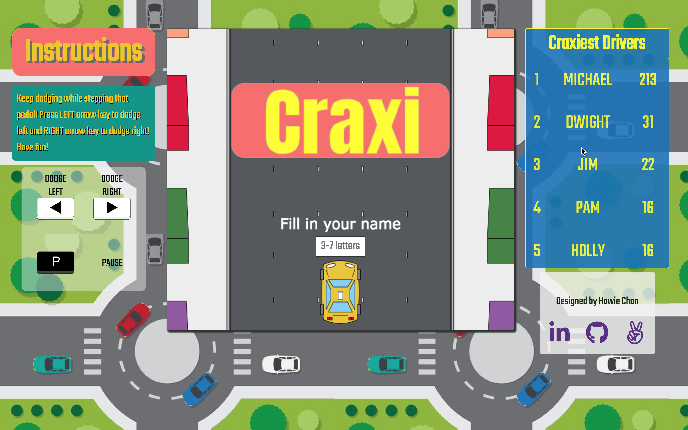

# Craxi
[Live!](http://www.h0wiechan.com/Craxi/)



Craxi is a car-dodging game inspired by Google's T-Rex Runner, built with Vanilla JavaScript. All game graphics of the game are handled by the HTML Canvas API.

Players unleash their hunger for speed as a New York cab driver, trying to dodge as many cars as possible while speeding through the city. Stay out of collision as long as possible to be the "best" driver!

## Feature Highlights
### Key Controls
```javascript
// additional keyHandler()...

keyHandlers() {
    document.addEventListener('keydown', this.keyDownHandler, false);
  }

keyDownHandler(e) {
  const nameInput = document.getElementById("name-input");
  if (this.game.name) {
    switch (e.keyCode) {
    case 81:
      if (this.game.inGame && this.game.paused) {
        this.bg.play();
        this.ctx.clearRect(0, 0, 725, 600);
        this.game = new Game(this.ctx);
        this.game.animate();
      }
      break;
    case 77:
      if (!this.game.inGame && this.game.paused) {
        this.ctx.clearRect(0, 0, 725, 600);
        this.game = new Game(this.ctx);
        this.game.resetInput(nameInput);
        this.game.animate();
      }
      break;
    case 80:
      if (!this.game.inGame && !this.game.paused) {
        this.game.inGame = true;
      } else if (this.game.inGame && !this.game.paused) {
        this.game.paused = true;
      } else if (this.game.inGame && this.game.paused) {
        this.game.paused = false;
        this.game.animate();
      }
      break;
    case 37:
      if (this.game.inGame && !this.game.paused) {
        if (this.game.taxi.posX > 142.5) {
          this.game.taxi.lane -= 1;
          this.turning.play();
          window.requestAnimationFrame(this.game.taxi.move(92.5 * -1));
        }
      }
      break;
    case 39:
      if (this.game.inGame && !this.game.paused) {
        if (this.game.taxi.posX < 512.5) {
          this.game.taxi.lane += 1;
          this.turning.play();
          window.requestAnimationFrame(this.game.taxi.move(92.5));
        }
      }
        break;
    default:
        break;
    }
  } else {
    switch (e.keyCode) {
    case 13:
      this.game.setName(nameInput);
      break;
    default:
      break;
    }
  }
}
```
### Smooth Animation
All the in-game animations are implemented by `requestAnimationFrame()`, which is optimized for animation and renders at a rate depending on what task your browser is carrying out. It also is an efficient method that respects users' battery life. By using `requestAnimationFrame()`, it allows the browser to execute functions such as `step()`, `draw()`, where the browser repaints around 60fps.

```javascript
// app.js
animate() {
    requestAnimationFrame = window.requestAnimationFrame ||
                            window.mozRequestAnimationFrame || 
                            window.webkitRequestAnimationFrame ||
                            window.myRequestAnimationFrame;
    if (!this.inGame && !this.paused) {
      this.time += 1;
      this.step();
      this.draw(this.ctx);
      requestAnimationFrame(this.animate);
    } else if (this.inGame && !this.paused) {
      this.step();
      this.generateCars(this.level);
      this.draw(this.ctx);
      requestAnimationFrame(this.animate);
    } else if (this.inGame && this.paused) {
      this.step();
      this.generateCars(this.level);
      this.draw(this.ctx);
      window.cancelAnimationFrame(this.animate);
      this.pauses += 1;
    } else if (!this.inGame && this.paused) {
      window.cancelAnimationFrame(this.animate);
    }
}

step() {
    this.collisionDetector();
    this.updateLevel();
    if (this.inGame && !this.paused) {
      switch (this.level) {
        case "I":
          this.steadyVelocity *= Math.pow(1.05, 1/600);
          this.randomVelocity *= Math.pow(1.05, 1/600);
          break;
        case "II":
          this.steadyVelocity *= Math.pow(1.05, 1/600);
          this.randomVelocity *= Math.pow(1.05, 1/600);
          break;
        case "III":
          this.steaqdyVelocity *= Math.pow(1.1, 1/600);
          this.randomVelocity *= Math.pow(1.1, 1/600);
          break;
        case "IV":
          this.steadyVelocity *= Math.pow(1.1, 1/600);
          this.randomVelocity *= Math.pow(1.1, 1/600);
          break;
        case "V":
          this.steadyVelocity *= Math.pow(1.15, 1/600);
          this.randomVelocity *= Math.pow(1.15, 1/600);
          break;
      }
    }
    this.moveSteadyObjects();
    this.moveRandomCars();
}

moveRandomCars() {
    this.randomCars.forEach((car) => {
        car.move(this.steadyVelocity);
    });
}

moveSteadyObjects() {
    this.moveBuildings(this.steadyVelocity);
    this.moveLaneLines(this.steadyVelocity);
  }
```

### Obstacle Generation
Cars on the road are conditionally generated depending on the current position of the taxi.

```javascript
// game.js
generateCars(level) {
    const scoreCheckpoints = {
      I: 50,
      II: 25,
      III: 0,
      IV: -25,
      V: -50,
      VI: -75,
    };
    if (this.randomCars.length === 0) {
      this.randomCars.push(Util.generateCar(this.taxi.lane, this.level, false));
    } else if (this.randomCars[this.randomCars.length - 1].posY >= scoreCheckpoints[level]) {
      this.randomCars.push(Util.generateCar(this.taxi.lane, this.level, true));
    }
}

// util.js 
const generateCar = (currentLane, level, checker = true) => {
    if (!checker) return new Sedan({lane: 3, posY: -500});
    const arrayLengths = {
        "I": 15,
        "II": 15,
        "III": 22,
        "IV": 22,
        "V": 35,
        "VI": 35, 
    }
    const currentLanes = Array.apply(null, Array(arrayLengths[level])).map(function (el) { return currentLane; })
    const lanes = [1, 2, 3, 4, 5].concat(currentLanes); // 327.5
    const lane = lanes[Math.floor(Math.random() * lanes.length)];
    const types = ["sedan"];
    const type = types[0];
    const options = {
        lane: lane,
        posY: -500,
    }
    const car = (type === "sedan") ? new Sedan(options) : null;
    return car;
}
```

## Scoreboard
To allow real-time rankings of drivers, the game uses Google Firebase's real-time database to capture all the scores after the player finishes the game.
```javascript
window.onload = () => {
    const scoreboard = document.getElementById("scoreboard");
    let database = firebase.database().ref("scores").orderByChild("score").limitToLast(5);
    let i = 5;
    database.on("child_added", (snapshot) => {
        const records = scoreboard.children;
        const data = snapshot.val();
        if (records.length === 5) {
            let tempName1;
            let tempScore1;
            let tempName2;
            let tempScore2;
            for (let i = 0; i < records.length; i++) {
                const record = records[i];
                let name = record.querySelector(".name").innerHTML;
                let points = record.querySelector(".points").innerHTML;
                if (tempScore2) {
                    tempName1 = name;
                    tempScore1 = points;
                    record.querySelector(".name").innerHTML = tempName2;
                    record.querySelector(".points").innerHTML = tempScore2;
                    tempName2 = null;
                    tempScore2 = null;
                    continue;
                } else if (tempScore1) {
                    tempName2 = name;
                    tempScore2 = points;
                    record.querySelector(".name").innerHTML = tempName1;
                    record.querySelector(".points").innerHTML = tempScore1;
                    continue;
                } else if (data.score >= parseInt(points)) {
                    tempName1 = name;
                    tempScore1 = points;
                    record.querySelector(".name").innerHTML = data.name;
                    record.querySelector(".points").innerHTML = data.score;
                    continue;
                }
            }
        } else {
            const row = document.createElement("tr");
            const keys = Object.keys(data);
            const rank = document.createElement("td");
            const n = document.createTextNode(i);
            rank.appendChild(n); // td
            row.appendChild(rank);
            keys.forEach((key) => {
                const datum = document.createElement("td");
                const value = document.createTextNode(data[key]);
                datum.appendChild(value); // td
                if (key === "name") datum.classList.add("name");
                if (key === "score") datum.classList.add("points");
                row.appendChild(datum); // tr -- td(n)
            })
            if (scoreboard.children.length === 0) {
                scoreboard.appendChild(row);
            } else {
                const previousData = document.querySelector("tr");
                scoreboard.insertBefore(row, previousData);
            }
            i--;
        }
    });
};
```


## Technologies Used
+ JavaScript
+ HTML Canvas
+ Google Firebase

## Future Implementations
+ Speedometer for user experience